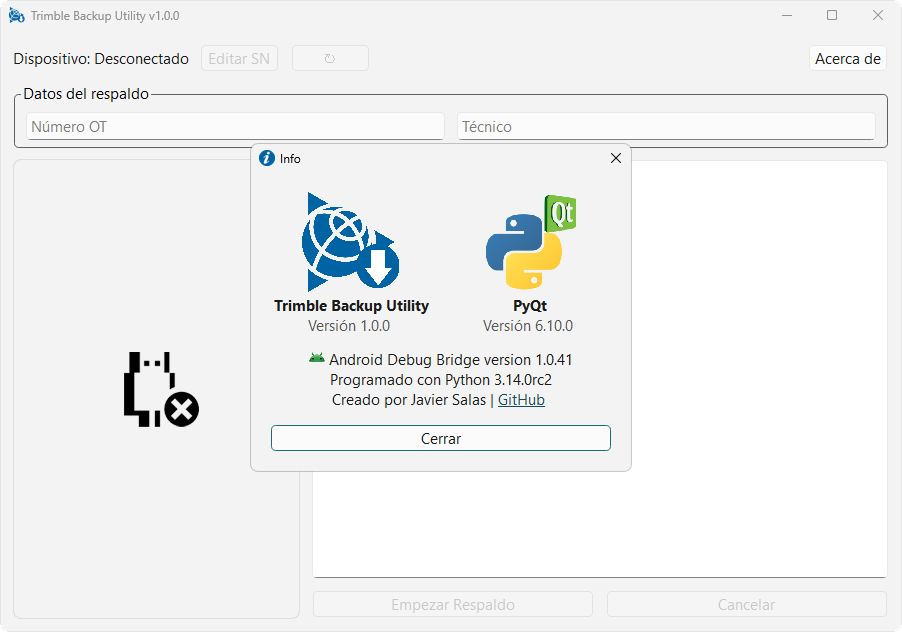
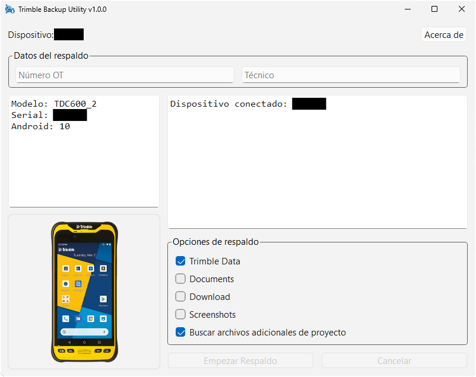

# Trimble Backup Utility

`Nota: Desarrollado para soporte técnico interno en entornos de gestión de equipos geoespaciales.`

Trimble Backup Utility es una aplicación ligera de escritorio para Windows diseñada para simplificar las operaciones de copia de seguridad de las colectoras de datos Trimble y Spectra basadas ​​en Android, utilizando ADB (Android Debug Bridge).

La herramienta está diseñada para entornos de servicio técnico, laboratorios de reparación e instalaciones de gestión de equipos donde se requieren flujos de trabajo fiables de extracción de datos y mantenimiento de dispositivos.

Proporciona una interfaz gráfica clara para automatizar la extracción de archivos y organizar las copias de seguridad de forma estructurada y controlada.

---

## Características

- Detección automática y dinámica de extensiones de archivo para respaldo
- Soporte para archivos geoespaciales y de proyecto (DXF, DWG, JXL, T02, etc.)
- Copia estructurada con preservación de rutas
- Compatible con colectoras basadas en Android de Trimble Inc. y Spectra Precision
- Flujo de trabajo optimizado para entornos de servicio técnico

---

## Vista previa de la aplicación

  
  

---

### Búsqueda adicional de archivos de proyecto

La opción de búsqueda adicional de archivos de proyecto permite localizar archivos de forma dinámica mediante filtrado por sufijo (extensión).

El sistema escanea el almacenamiento del dispositivo y respalda automáticamente los archivos que coincidan con las siguientes extensiones:

#### Extensiones de archivos respaldados
`
.csv   .dxf   .dwg   .ttm   .job   .jxl
.t02   .t04   .dat   .rnx   .obs   .nav
.shp   .dbf   .prj   .kml   .kmz   .txt
.asc   .xml
`

#### Archivos geoespaciales y GNSS

- DXF / DWG — Dibujos CAD
- JXL / JOB / TTM — Archivos de proyecto Trimble
- T02 / T04 — Datos GNSS propietarios
- RNX / OBS / NAV — Datos RINEX
- SHP / DBF / PRJ — Shapefiles (ESRI)
- KML / KMZ — Datos geográficos compatibles con Google Earth

#### Archivos de datos y configuración

- CSV / DAT / TXT / ASC — Datos tabulares y exportaciones
- XML — Configuraciones y metadatos

---

## Requisitos

- Windows 10/11
- Depuración USB habilitada en el dispositivo
- Colectora Trimble o Spectra basada en Android
- Conexión USB

---

## Dispositivos compatibles

### Trimble

- TSC5  
- TSC510  
- TSC710  
- TCU5  
- TDC6  
- TDC600  
- TDC100  

### Spectra

- MobileMapper 6  
- MobileMapper 60  
- MobileMapper 5  
- Ranger 5  

---

## Instalación

1. Descarga la última versión desde la sección **Releases**.
2. Ejecuta el archivo ejecutable.
3. Activa la depuración USB en la colectora.
4. Conecta tu dispositivo por USB.
5. Inicia la copia de seguridad, ingresando datos de OT y técnico.

---

## Versionado

Este proyecto sigue el control de versiones semántico:

MAJOR.MINOR.PATCH  
Ejemplo: `v1.0.0`

---

## Limitaciones conocidas

- Solo para Windows
- Requiere activación y desactivación manual de la depuración USB
- El dispositivo debe autorizar el ordenador al conectarse por primera vez

---

## Licencia

Este proyecto está licenciado bajo la Licencia MIT.  
Consulta el archivo [LICENSE](LICENSE) para más detalles.

---

## Autor

Javier Salas
