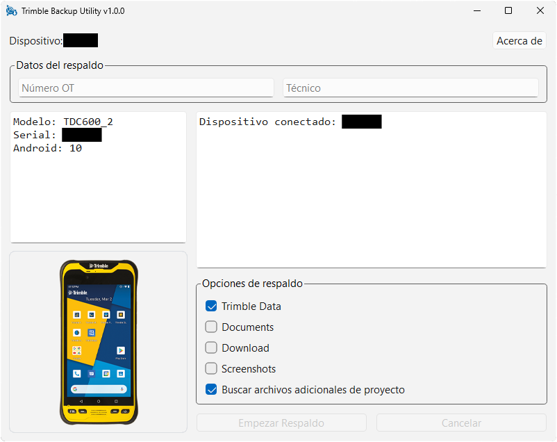

[](https://microsoft.com/windows/)

[](https://opensource.org/licenses/MIT)

---

# Descargar
[](https://github.com/schweineorgel/trimble-backup-utility/releases/latest)

## Requisitos

- Windows 10/11
- [Depuración USB](https://www.xatakandroid.com/tutoriales/como-activar-opciones-desarrollador-android-sirve) habilitada en la colectora Trimble/Spectra Android
- Conexión USB

---

# Trimble Backup Utility

`Nota: Desarrollado para soporte técnico interno en entornos de gestión de equipos geoespaciales.`
Trimble Backup Utility es una aplicación ligera para Windows que automatiza y estandariza el respaldo de colectoras Trimble y Spectra basadas en Android mediante ADB (Android Debug Bridge).

Está diseñada para entornos de servicio técnico, reparación y gestión de equipos geoespaciales, donde la extracción manual de datos suele ser lenta, propensa a errores y difícil de organizar.

La herramienta permite reducir significativamente el tiempo de respaldo, asegurar la integridad de los datos y mantener una estructura ordenada basada en órdenes de trabajo y técnicos responsables.

## Características

- Busqueda de archivos geoespaciales y de proyecto asociados (DXF, DWG, JXL, T02, etc.)
- Copia estructurada con preservación de rutas
- Compatible con colectoras basadas en Android de Trimble Inc. y Spectra Precision
- Ingreso de orden de trabajo (OT, ej: "70648") y número de técnico ("T-X", ej: "T-37")
- Generación de .txt post-respaldo para trazabilidad (Fecha, S/N, técnico responsable, etc.)

---

## Vista previa de la aplicación

<p align="center">
  
</p>

### Búsqueda adicional de archivos de proyecto

La opción de búsqueda adicional de archivos de proyecto permite localizar archivos de forma dinámica mediante filtrado por sufijo (extensión). El sistema escanea el almacenamiento del dispositivo y respalda automáticamente los archivos que coincidan con las siguientes extensiones:

#### Extensiones de archivos respaldados
```
.csv   .dxf   .dwg   .ttm   .job   .t01
.t02   .t04   .dat   .rnx   .obs   .nav
.shp   .dbf   .prj   .kml   .kmz   .txt
.asc   .xml   .log   .rw5   .shx   .jps
.g3    .raw   .dc    .bin   .rtcm  .crd
```
*Nota: Esta lista se actualiza continuamente según nuevos casos encontrados.

---

## Dispositivos compatibles

### Trimble

| Dispositivo | Probado | Notas |
|-------------|---------|-------|
| TSC5        | Sí      |  |
| TSC510      | Sí |  |
| TSC710      | No      |  |
| TCU5        | No      |  |
| TDC6        | Sí |  |
| TDC600      | Sí      | Android 8 puede requerir ingreso manual de S/N
| TDC100      | No      |  |

### Spectra

| Dispositivo     | Probado |
|-----------------|---------|
| MobileMapper 6  | No      |
| MobileMapper 60 | Parcial      |
| MobileMapper 5  | No      |
| Ranger 5        | No      |

---

## Versionado

Este proyecto sigue el control de versiones semántico:

MAJOR.MINOR.PATCH  
Ejemplo: `v1.0.0`

---

## Licencia

Este proyecto está licenciado bajo la Licencia MIT.  
Consulta el archivo [LICENSE](LICENSE) para más detalles.

---

## Autor

Javier Salas Bocaz
